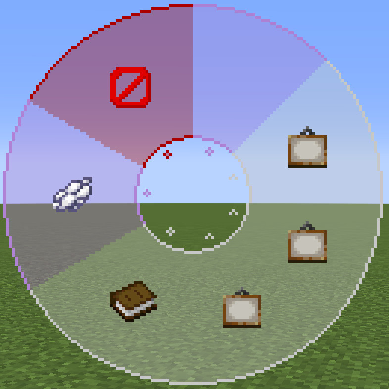

Language: 　**English**　|　[日本語](./README_jp.md)

# ButterflyWings
This is the avatar for [Figura](https://modrinth.com/mod/figura), the skin mod for [Minecraft](https://www.minecraft.net/en-us), which adds butterfly wings and feelers.

Target Figura versions: [0.1.1](https://modrinth.com/mod/figura/version/0.1.1+1.20.1-0f8b7a9)~

## Features
**Notes**
- The skin of this avatar will be your one (The skin appears in the attached screenshots is not included with the avatar).
- Hereafter, the color of the wings will be presented as default.

---

- Has butterfly wings and feelers.

  

  - The are usually closed, but will be opened when flapping or snaking.

    

- The color and opacity of the wings can be changed as you like.
  - You can change 4 regions of color in the wings.
  - Also has the color import/export feature and the feature which stores up to 6 color sets.

  

- The wings flap when staying in the air.
  - "Staying in the air" means doing the following actions:
    - Creative flying
    - Elytra flying
    - Having a slow falling effect
  - Unique animations will be played when moving or stopping in creative flight.
  - Particles will emit from the wings when the flapping.
    - Their color will be same as the color of the wings.
    - Can be changes their display duration in the action wheel.
    - They look good in the dark because they glow (look better with the shaders).
  - The flapping sound will be played small when flapping.

  

- The feelers will sway with the player's movements.

  

- The wings will glow in the dark.
  - This feature can be disabled in the action wheel.
  - This isn't the feature to make the wings light sources.

  

- The wings will be tattered as the player's health decreases.
  - Their flying abilities won't be weak even if their wings are tattered.

  

- Sleeps on your back not to interfere the wings and the bed.

  

## The action wheel
Figura provides the action wheel with which players can play some actions (emotes, animations, configs, and etc.). It will be shown when holding the action wheel key (default is B key). This avatar also has some actions.

### Action 1~4. Change wing colors
Specifies the color with the color picker and changes wing colors. The wing areas where can be changed are followings:

1. Wing base gradient top
2. Wing base gradient bottom
3. Edge
4. Pattern

#### Color picker action 1. Current color
Displays current color.

#### Color picker action 2~4. Change hue, saturation, and brightness
Changes hue, saturation, and brightness by scrolling on each actions. You can scroll faster by holding the sprint key (default is L-Ctrl).

#### Color picker action 5. Copy/Paste
Left-click to copy the current color. Then, right-click to paste the copied color. The copied color will be erased after unloading the avatar.

#### Color picker action 6. Reset color
Resets the color to default.

#### Color picker action 7. Close color picker
Left-click to apply the selected color and close the color picker. Right-click to close the color without applying it.

### Action 5. Change wing opacity
Changes the wing opacity by scrolling on the action. You can scroll faster by holding the sprint key (default is L-Ctrl).

### Action 6. Toggle wing glow
Toggles whether the wings glow or not.

### Action 7. Change particle durations
Changes durations of the particle which are emitted while flapping the wings by scrolling on the action. The options are followings:

| name | duration (seconds) |
| - | - |
| none | 0 |
| short | 1.5 |
| normal | 3 |
| long | 6 |
| very long | 12 |

### Action 8. The color palette
Saves/Loads color sets (called palettes).

#### Color palette action 1. Current palette
Showing current palette. Left-click to copy current palette to the clipboard. You can save it as a text file. Right-click to apply the color palette from the clipboard.

#### Color palette action 2~7. Palettes
Saves up to 6 palettes. The default palette is saved in each slots if the slot is empty. Left-click to load and apply the palette. Right-click to save current palette.

#### Color palette action 8. Close the color palette
Closes the color palette.

## How to use
Figura is available in [Forge](https://files.minecraftforge.net/net/minecraftforge/forge/), [Fabric](https://fabricmc.net/), and [Quilt](https://quiltmc.org/).

1. Install the mod loader which you want to use and make the mods available.
2. Install [Figura](https://modrinth.com/mod/figura). Note the mod dependencies.
3. Go to the download page for the character which you want to download.
4. Click green "**<>Code**" button at the top of the page and "**Download ZIP**" to download the repository files (or clone this repository).
5. Extract the file if it is a zipped file.
6. Put avatar files at `<minecraft_instance_directory>/figura/avatars/`.
   - The directory will automatically generated after launching the game with Figura installed. You can also create it manually if it doesn't exist.
7. Open the Figura menu (Δ mark) from the game menu.
8. Select the avatar from the avatar list at the left of the Figura menu.
9. Sets your permission if you need.
10. Other Figura players can see your avatar after uploading your avatar to the Figura server.

## Notes
- I'm not responsible for any damages caused by using this avatar.
- This avatar is designed for work with no resource pack and no other mods are installed. An unexpected issue may occurs when you use it with any resource packs and mods (texture and armor inconsistencies, etc.). However, I won't support in these cases.
- Please [report an issue](https://github.com/Gakuto1112/ButterflyWings/issues) if you find it.
