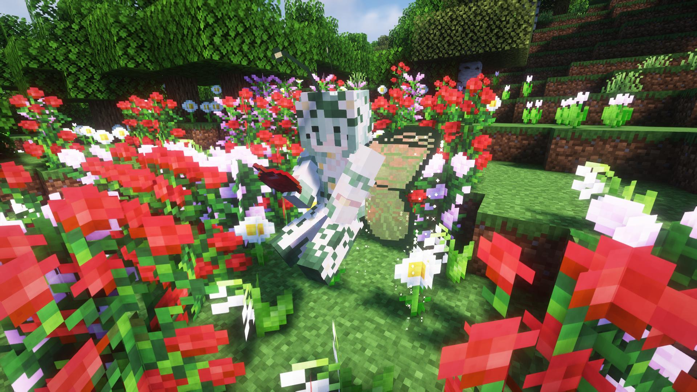
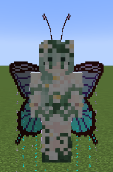
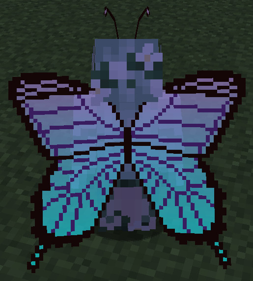

Language: 　**English**　|　[日本語](./README_jp.md)

# ButterflyWings
This is the avatar for [Figura](https://modrinth.com/mod/figura), the skin mod for [Minecraft](https://www.minecraft.net/en-us), which adds butterfly wings and feelers.

Target Figura versions: [0.1.1](https://modrinth.com/mod/figura/version/0.1.1+1.20.1-0f8b7a9)~

## Features
**Notes**
- The skin of this avatar will be your one (The skin appears in the attached screenshots is not included with the avatar).
- Hereafter, the color of the wings will be presented as default.

---

- Has butterfly wings and feelers.

  

  - The are usually closed, but will be opened when flapping or snaking.

    

- The color and opacity of the wings can be changed as you like.
  - You can change 4 regions of color in the wings.
  - Also has the color import/export feature and the feature which stores up to 6 color sets.

  

- The wings flap when staying in the air.
  - "Staying in the air" means doing the following actions:
    - Creative flying
    - Elytra flying
    - Having a slow falling effect
  - Unique animations will be played when moving or stopping in creative flight.
  - Particles will emit from the wings when the flapping.
    - Their color will be same as the color of the wings.
    - Can be changes their display duration in the action wheel.
    - They look good in the dark because they glow (look better with the shaders).
  - The flapping sound will be played small when flapping.

  

- The feelers will sway with the player's movements.

  

- The wings will glow in the dark.
  - This feature can be disabled in the action wheel.
  - This isn't the feature to make the wings light sources.

  

- The wings will be tattered as the player's health decreases.
  - Their flying abilities won't be weak even if their wings are tattered.

  