言語: 　[English](./README.md)　|　**日本語**

# ButterflyWings
プレイヤーに蝶の羽と触角を追加する、スキンMod「[Figura](https://modrinth.com/mod/figura)」向けスキンです。

ターゲットFiguraバージョン：[0.1.1](https://modrinth.com/mod/figura/version/0.1.1+1.20.1-0f8b7a9)~

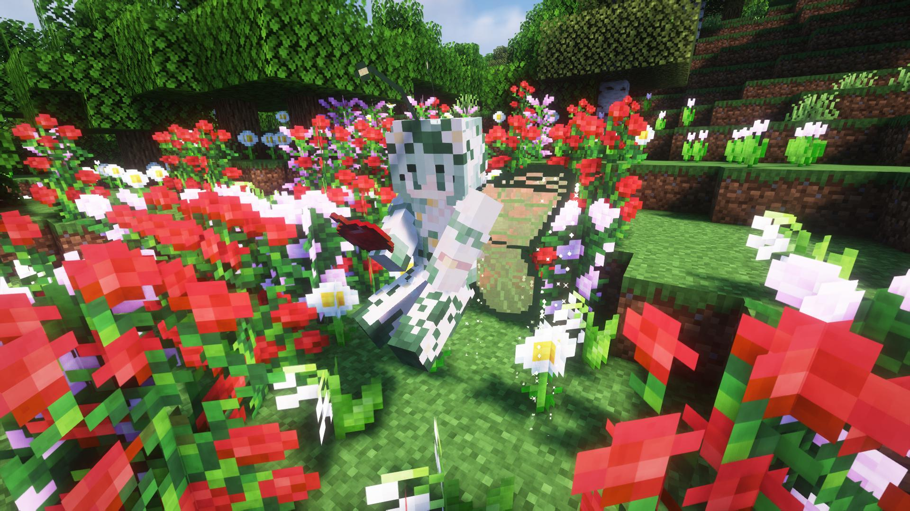

## 特徴
**注意事項**
- 実際のアバターはプレイヤーのスキンに蝶の羽と触角が追加されたものになります（写真のスキンはアバターには含まれていません）。
- 以降、羽の色はデフォルトで紹介します。

---

- 蝶の羽と触角が追加されます。

  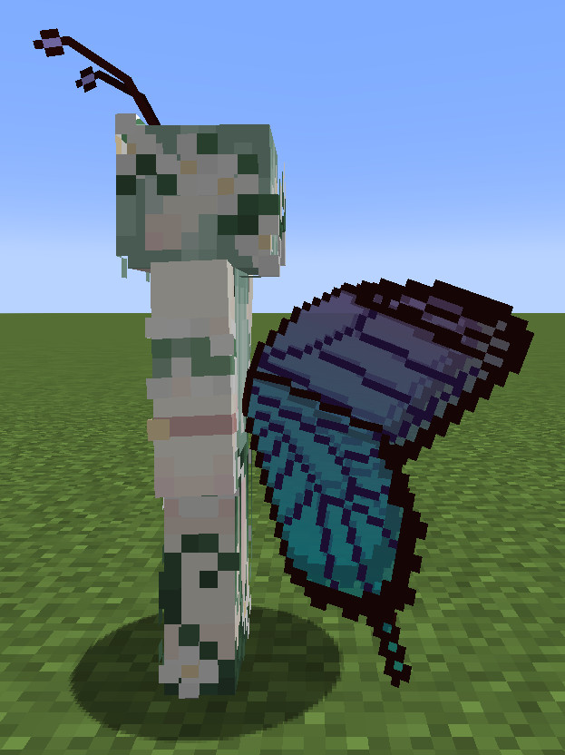

  - 羽は普段閉じていますが、羽ばたく時やスニークをする時に開きます。

    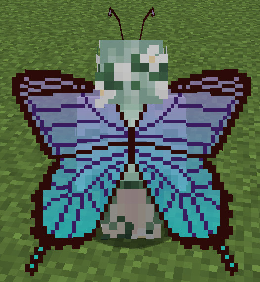

- 羽の色や透明度は自由に設定できます。
  - 羽の色は4つ指定できます。
  - 色のインポート/エクスポート機能や色の組み合わせを6つまで保存できる機能もあります。

  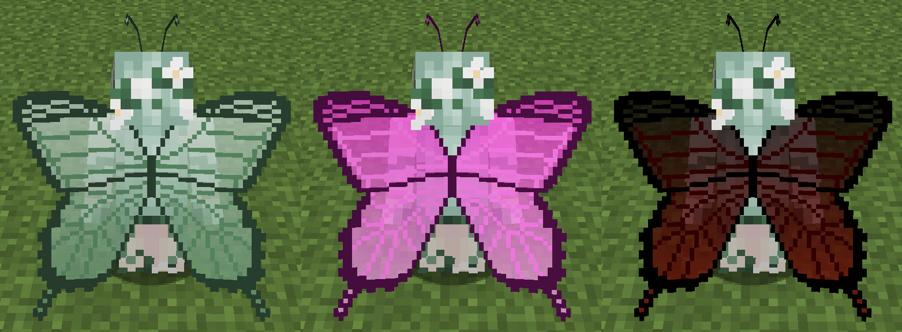

- 空中に留まることで、羽が羽ばたきます。
  - 「空中に留まる」とは、以下のアクションを指します。
    - クリエイティブ飛行
    - エリトラ飛行
    - 低速落下バフ
  - クリエイティブ飛行では、移動時、停止時に固有のアニメーションが再生されます（写真参照）。
  - 羽ばたく時は羽からパーティクルが表示されます。
    - パーティクルの色は羽の色と同じになります。
    - 設定でパーティクルの表示時間を変更できます。
    - パーティクルは光るので暗い所で映えます（シェーダーを適用すると更に映えます）。
  - 羽ばたきの際は、羽ばたく音が小さく再生されます。

  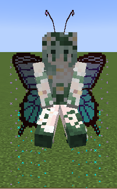

- 触角はプレイヤーの動きに合わせて揺れます。

  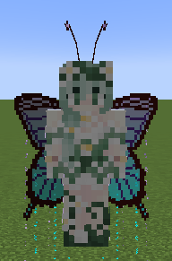

- 暗い所で羽が発光します。
  - この機能は設定で無効にできます。
  - 羽が光源になる機能ではありません。

  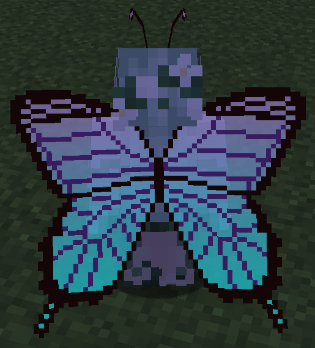

- HPが低下すると羽がボロボロになってしまいます。
  - 羽がボロボロになったからといって、飛行能力が落ちることはありません。

  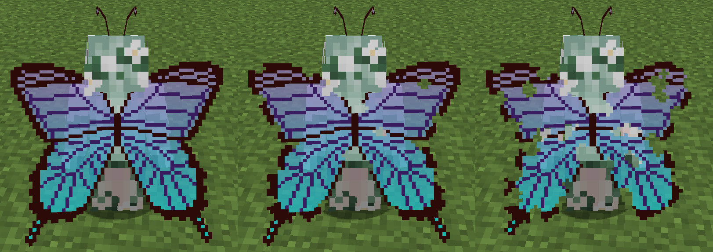

- 羽がベッドと干渉しないように、仰向けで寝ます。

  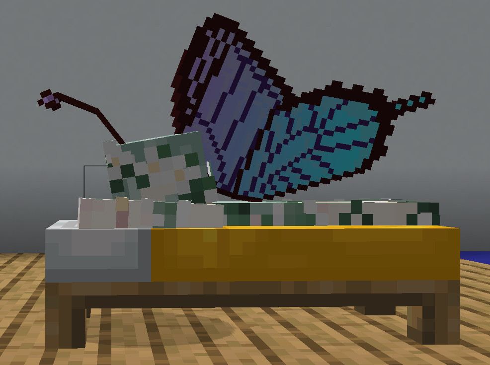

## アクションホイール
Figuraには、アクションホイールキー（デフォルトは「B」キー）を押すことで、エモートなどを実行できるリングメニューが実装されています。このアバターにもいくつかのアクションが用意されています。

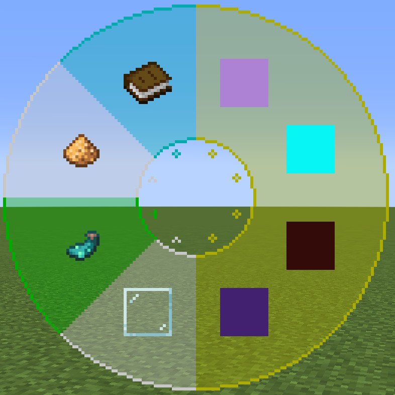

### アクション1～4. 羽の色の変更
カラーピッカーで色を指定して、羽の色を変更できます。変更できる箇所は以下の通りです。

1. グラデーションの上
2. グラデーションの下
3. 縁
4. 模様

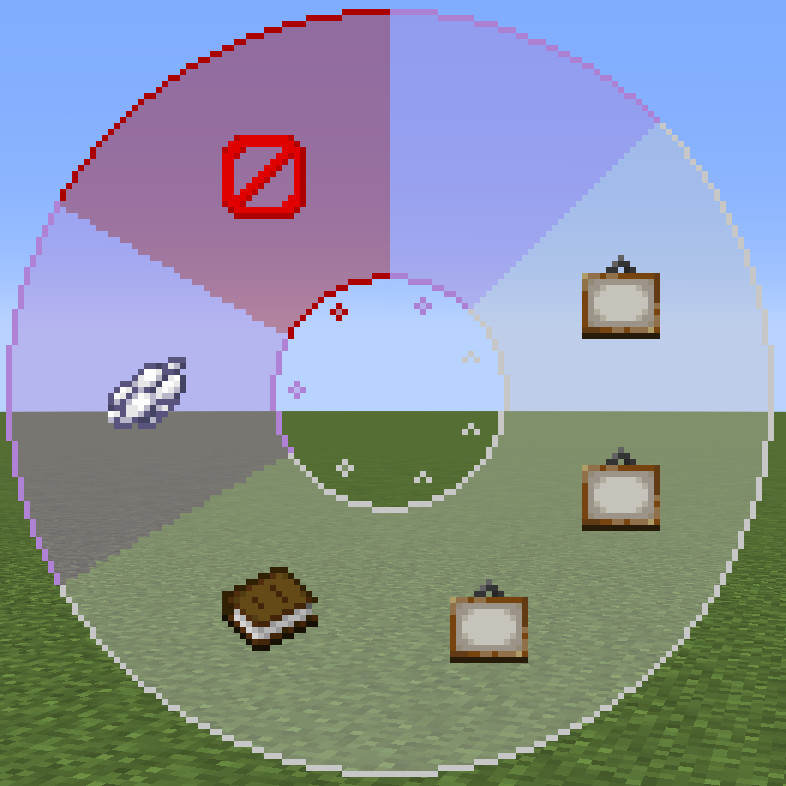

#### カラーピッカーアクション1. 現在の色
設定中の色のプレビューを表示します。

#### カラーピッカーアクション2～4. 色相・彩度・明度の設定
各アクションのスクロールでそれぞれ色相・彩度・明度を設定します。ダッシュキー（デフォルトでは左Ctrl）を押しながらスクロールをすると高速でスクロールできます。

#### カラーピッカーアクション5. 色のコピー・ペースト
左クリックで設定中の色をコピーできます。その後、右クリックでコピーした色を適用できます。コピーした色はアバターの再読み込み時に消えます。

#### カラーピッカーアクション6. 色のリセット
設定中の色をデフォルトの色にリセットします。

#### カラーピッカーアクション7. カラーピッカーを閉じる
左クリックで設定した色を適用してカラーピッカーを閉じます。右クリックで設定した色を適用せずにカラーピッカーを閉じます。

### アクション5. 羽の透明度の変更
アクションをスクロールで羽の透明度を変更できます。ダッシュキー（デフォルトでは左Ctrl）を押しながらスクロールをすると高速でスクロールできます。

### アクション6. 羽の発光の変更
羽を発光させるかどうかを変更できます。

### アクション7. パーティクルの表示時間の変更
アクションをスクロールで羽ばたいている時のパーティクルの表示時間を変更できます。設定できる名前と表示時間は以下の通りです。

| 設定名 | 表示時間（秒） |
| - | - |
| なし | 0 |
| 短い | 1.5 |
| ふつう | 3 |
| 長い | 6 |
| とても長い | 12 |

### アクション8. カラーパレット
羽の色の組み合わせ（パレットと呼びます）を保存したり、保存したパレットを読み込んだりできる機能です。

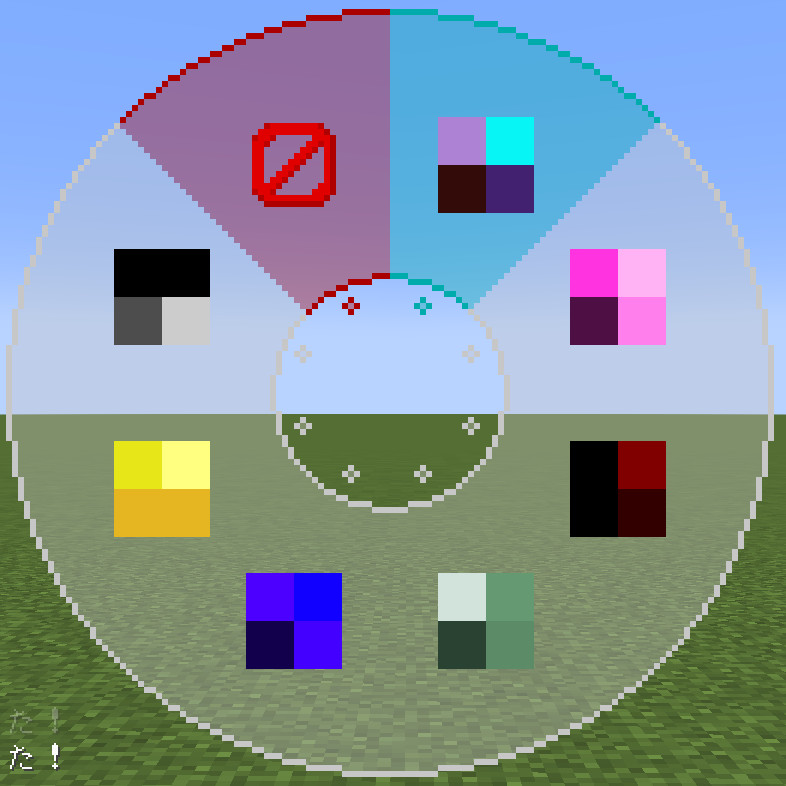

#### カラーパレットアクション1. 現在のパレット
現在のパレットを表示しています。左クリックで現在のパレットの情報をクリップボードにコピーします。別途テキストデータとして保存しておくことができます。右クリックでクリップボードからパレットの情報を読み込んで、現在のパレットに適用します。

#### カラーパレットアクション2～7. パレット
6つまでパレットを保存できます。画像では、パレットが保存済みですが、パレット空の場合は代わりにデフォルトのパレットが保存されています。左クリックでパレットを読み込んで現在のパレットに適用します。右クリックで現在のパレットを保存します。

#### カラーパレットアクション8. カラーパレットを閉じる
カラーパレットを閉じます。

## 使用方法
1. マインクラフトに[Fabric](https://fabricmc.net/)をインストールし、[Fabric API](https://www.curseforge.com/minecraft/mc-mods/fabric-api)と[Figura 0.1.1](https://modrinth.com/mod/figura/version/0.1.1+1.20.1-0f8b7a9)を追加します。各Modの依存関係にご注意ください。
2. ページ上部の緑色のボタン「**Code**」から「**Download ZIP**」からこのレポジトリのファイルをダウンロードします。（または、このレポジトリをクローンします。）
3. 圧縮ファイルの場合は展開します。
4. ``<マインクラフトのゲームフォルダ>/figura/avatars/``にアバターのデータを配置します。
   - フォルダはFiguraを追加したマインクラフトを一度起動すると自動的に生成されます。ない場合は手動で作成しても構いません。
5. ゲームメニューからFiguraメニュー（Δマーク）を開き、画面左のアバターリストから「Butterfly Wings」を選択します。
6. 必要に応じて[権限設定](#推奨設定)をして下さい。
7. アバターをサーバーにアップロードすると、他のFiguraプレイヤーもあなたのアバターを見ることができます。

## 使用方法
Figuraは[Forge](https://files.minecraftforge.net/net/minecraftforge/forge/)、[Fabric](https://fabricmc.net/)、[Quilt](https://quiltmc.org/)に対応しています。

1. 使用したいModローダーをインストールし、Modを使用できる状態にします。
2. [Figura](https://modrinth.com/mod/figura)を追加します。Modの依存関係にご注意ください。
3. 使用したいキャラクターのダウンロードページに移動します。
4. ページ上部の緑色のボタン「**Code**」から「**Download ZIP**」からこのレポジトリのファイルをダウンロードします。（または、このレポジトリをクローンします。）
5. 圧縮ファイルの場合は展開します。
6. `<マインクラフトのゲームフォルダ>/figura/avatars/`にアバターのデータを配置します。
   - Figuraを導入した状態で一度ゲームを起動すると自動的に作成されます。存在しない場合は手動での作成も可能です。
7. ゲームメニューからFiguraメニュー（Δマーク）を開きます。
8. 画面左のアバターリストからアバターを選択します。
9. 必要に応じて権限設定をして下さい。
10. アバターをサーバーにアップロードすると、他のFiguraプレイヤーもあなたのアバターを見ることができます。

## 注意事項
- このアバターを使用して発生した、いかなる損害の責任も負いかねます。
- このアバターは、デフォルトのリソースパックでの動作を想定しています。また、他MODの使用は想定していません。想定動作環境外ではテクスチャの不整合、防具が表示されない/非表示にならない、といった不具合が想定されます。この場合の不具合は対応しませんのでご了承下さい。
- 不具合がありましたら、[Issues](https://github.com/Gakuto1112/ButterflyWings/issues)までご連絡下さい。
