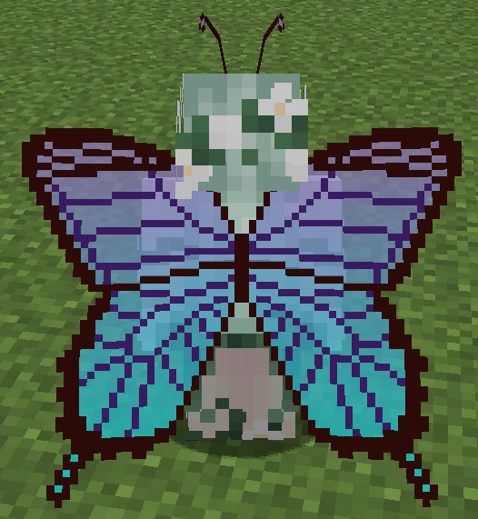
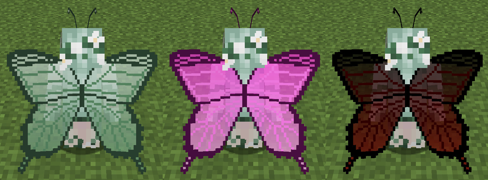
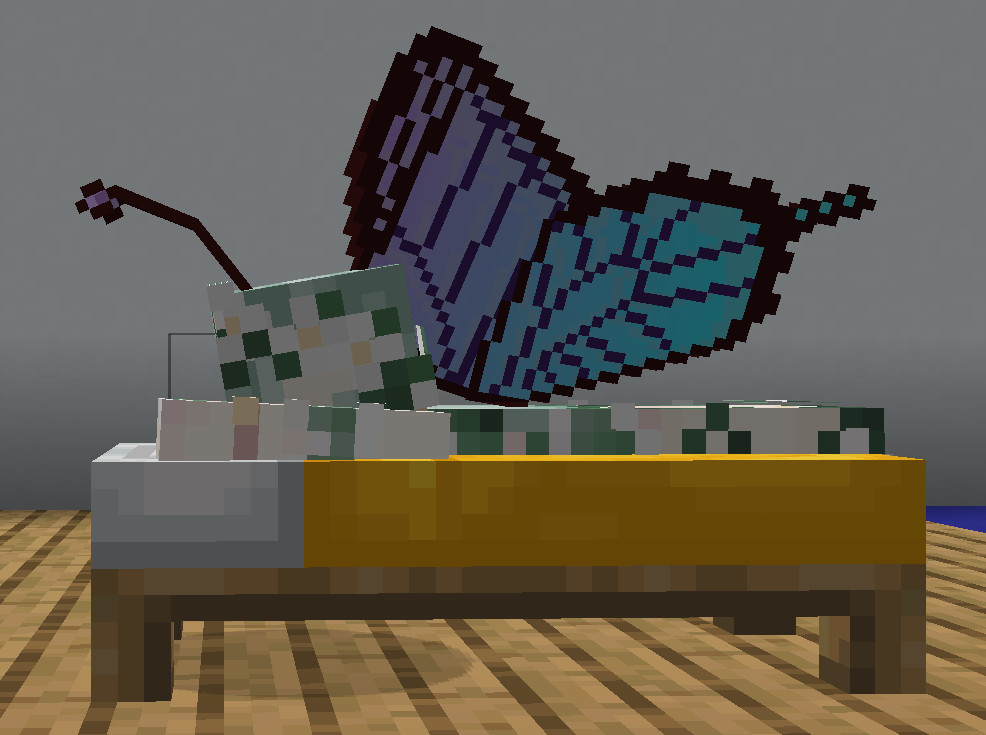
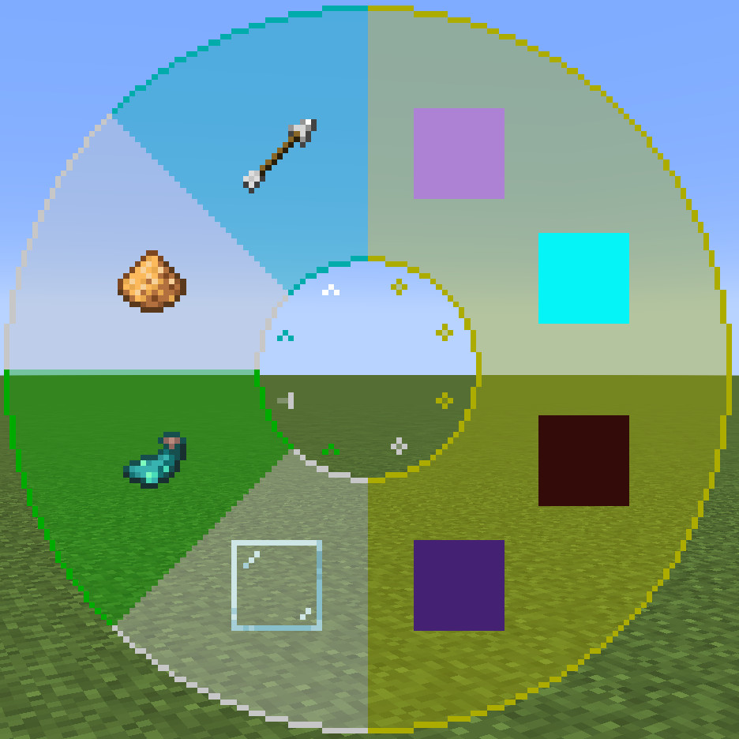
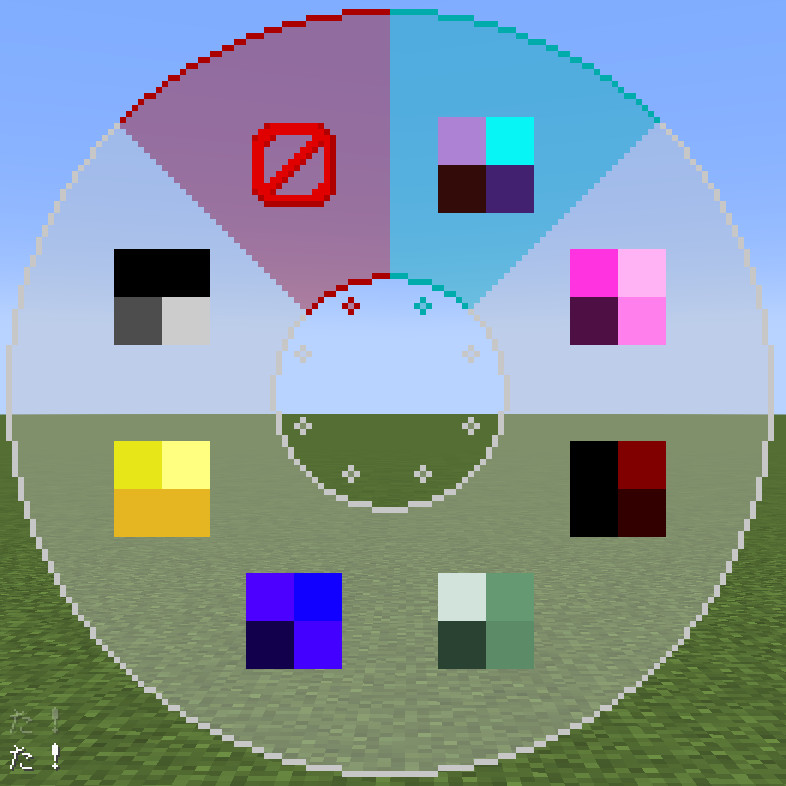

<!-- $inject(locale_link) -->

# ButterflyWings
<!-- DESCRIPTION_START -->
プレイヤーに蝶の羽と触角を追加する、スキンMod「[Figura](https://modrinth.com/mod/figura)」向けスキンです。

ターゲットFiguraバージョン：[0.1.5](https://modrinth.com/mod/figura/version/0.1.5b+1.21.4)
<!-- DESCRIPTION_END -->

## 特徴
**注意事項**
- 実際のアバターはプレイヤーのスキンに蝶の羽と触角が追加されたものになります（写真のスキンはアバターには含まれていません）。
- 以降、羽の色はデフォルトで紹介します。

---

- 蝶の羽と触角が追加されます。

  

  - 羽は普段閉じていますが、羽ばたく時やスニークをする時に開きます。

    

- 羽の色や透明度は自由に設定できます。
  - 羽の色は4つ指定できます。
  - 色のインポート/エクスポート機能や色の組み合わせを6つまで保存できる機能もあります。

  

- 空中に留まることで、羽が羽ばたきます。
  - 「空中に留まる」とは、以下のアクションを指します。
    - クリエイティブ飛行
    - エリトラ飛行
    - 低速落下バフ
  - クリエイティブ飛行では、移動時、停止時に固有のアニメーションが再生されます（写真参照）。
  - 羽ばたく時は羽からパーティクルが表示されます。
    - パーティクルの色は羽の色と同じになります。
    - 設定でパーティクルの表示時間を変更できます。
    - パーティクルは光るので暗い所で映えます（シェーダーを適用すると更に映えます）。
  - 羽ばたきの際は、羽ばたく音が小さく再生されます。

  

- 触角はプレイヤーの動きに合わせて揺れます。

  

- 暗い所で羽が発光します。
  - この機能は設定で無効にできます。
  - 羽が光源になる機能ではありません。

  

- HPが低下すると羽がボロボロになってしまいます。
  - 羽がボロボロになったからといって、飛行能力が落ちることはありません。

  

- 羽がベッドと干渉しないように、仰向けで寝ます。

  

## アクションホイール
Figuraには、アクションホイールキー（デフォルトは「B」キー）を押すことで、エモートなどを実行できるリングメニューが実装されています。このアバターにもいくつかのアクションが用意されています。

### ページ1

#### アクション1-1～1-4. 羽の色の変更
カラーピッカーで色を指定して、羽の色を変更できます。変更できる箇所は以下の通りです。

1. グラデーションの上
2. グラデーションの下
3. 縁
4. 模様

##### カラーピッカーアクション1. 現在の色
設定中の色のプレビューを表示します。

##### カラーピッカーアクション2～4. 色相・彩度・明度の設定
各アクションのスクロールでそれぞれ色相・彩度・明度を設定します。ダッシュキー（デフォルトでは左Ctrl）を押しながらスクロールをすると高速でスクロールできます。

##### カラーピッカーアクション5. 色のコピー・ペースト
左クリックで設定中の色をコピーできます。その後、右クリックでコピーした色を適用できます。コピーした色はアバターの再読み込み時に消えます。

##### カラーピッカーアクション6. 色のリセット
設定中の色をデフォルトの色にリセットします。

##### カラーピッカーアクション7. カラーピッカーを閉じる
左クリックで設定した色を適用してカラーピッカーを閉じます。右クリックで設定した色を適用せずにカラーピッカーを閉じます。

#### アクション1-5. 羽の透明度の変更
アクションをスクロールで羽の透明度を変更できます。ダッシュキー（デフォルトでは左Ctrl）を押しながらスクロールをすると高速でスクロールできます。

#### アクション1-6. 羽の発光の変更
羽を発光させるかどうかを変更できます。

#### アクション1-7. パーティクルの表示時間の変更
アクションをスクロールで羽ばたいている時のパーティクルの表示時間を変更できます。設定できる名前と表示時間は以下の通りです。

| 設定名 | 表示時間（秒） |
| - | - |
| なし | 0 |
| 短い | 1.5 |
| ふつう | 3 |
| 長い | 6 |
| とても長い | 12 |

## ページ2

#### アクション2-1. カラーパレット
羽の色の組み合わせ（パレットと呼びます）を保存したり、保存したパレットを読み込んだりできる機能です。

##### カラーパレットアクション1. 現在のパレット
現在のパレットを表示しています。左クリックで現在のパレットの情報をクリップボードにコピーします。別途テキストデータとして保存しておくことができます。右クリックでクリップボードからパレットの情報を読み込んで、現在のパレットに適用します。

##### カラーパレットアクション2～7. パレット
6つまでパレットを保存できます。画像では、パレットが保存済みですが、パレット空の場合は代わりにデフォルトのパレットが保存されています。左クリックでパレットを読み込んで現在のパレットに適用します。右クリックで現在のパレットを保存します。

##### カラーパレットアクション8. カラーパレットを閉じる
カラーパレットを閉じます。

### アクション2-2. アバターの更新確認
左クリックすると、アバターのアップデートがあるかどうかを確認します。アップデートの確認が失敗しても、このアクションからアップデートの確認を再試行できます。なお、ここより手動でアップデートを確認するほかに、1日1回自動的にアップデートの確認を行います。

> [!IMPORTANT]
> アップデートの確認を行うには、Figuraの設定から、「Allow Networking」を有効にし、`api.github.com`を通信許可リストに入れる必要があります！

> [!CAUTION]
> FiguraのNetworking機能を有効にする際に、ネットワークフィルターを「Whitelist」以外で運用するのは危険です。このアバターでは安全なリンクを利用しますが、他のプレイヤーのアバターが利用するリンクが安全である保障はありません。また、この機能を使用して発生したいかなる損害の責任も負いかねます。

> [!WARNING]
> アップデートの確認を短時間で繰り返し行うと、一時的にGitHub側から制限が課せられ、しばらくの間アップデートの確認を行えなくなります。

右クリックすると、最新のアバターのダウンロードリンクをクリップボードにコピーします。お使いのブラウザからダウンロードページにアクセスしてください。なお、1回もアップデートの確認を行っていなかったり、長期間アップデートの確認を行っていなかったりする場合は正常なリンクを取得できませんのでご注意ください。

## アバターのバージョン表示
v1.1.0より、アクションホイールを開けている際に、画面左上に現在使用中のアバターのバージョンとアップデートの有無が表示されます。

アップデートの確認は、1日1回自動で行われますが、[アクションホイール](#アクション2-2-アバターの更新確認)より手動で行うこともできます。

新しいアバターのバージョンが利用可能な場合は、通知が送信されます。[アクションホイール](#アクション2-2-アバターの更新確認)より最新バージョンのダウンロードリンクが取得できますので、お使いのブラウザからアクセスしてください。

> [!IMPORTANT]
> アップデートの確認を行うには、Figuraの設定から、「Allow Networking」を有効にし、`api.github.com`を通信許可リストに入れる必要があります！

> [!CAUTION]
> FiguraのNetworking機能を有効にする際に、ネットワークフィルターを「Whitelist」以外で運用するのは危険です。このアバターでは安全なリンクを利用しますが、他のプレイヤーのアバターが利用するリンクが安全である保障はありません。また、この機能を使用して発生したいかなる損害の責任も負いかねます。

> [!WARNING]
> アップデートの確認を短時間で繰り返し行うと、一時的にGitHub側から制限が課せられ、しばらくの間アップデートの確認を行えなくなります。

<!-- $inject(how_to_use) -->

<!-- $inject(notes) -->